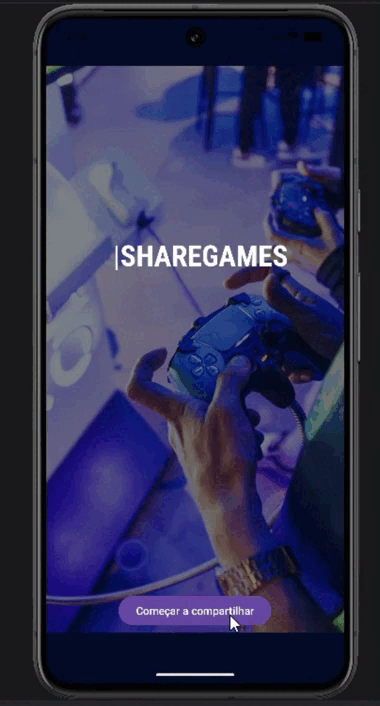

# 📱 Android App - Game Sharing

A simple Android application built with Java that allows users to navigate between screens and share game recommendations via email.
🔗 GitHub Profile: https://github.com/catiusciacenteno
---

## 📸 Preview

---

## 🎯 Features

* Navigate between screens using Activities
* Share game recommendations via email
* Interactive buttons for different games
* Basic user feedback using Snackbar

---

## 🛠️ Technologies

* Java
* Android SDK
* Intents (navigation and external actions)
* Material Design components (Snackbar)

---

## 📚 What I learned

* How to create and manage multiple Activities
* How to use Intents for navigation and external communication
* Handling user interactions with buttons
* Providing feedback to users with Snackbar

---

## 📱 How it works

1. The user starts on the main screen
2. Clicks a button to navigate to the second screen
3. Selects a game
4. The app opens the email app with a pre-filled message sharing the game link

---

## 🚀 Future Improvements

* Migrate the project to Kotlin
* Improve UI/UX design
* Add more dynamic content instead of hardcoded data
* Implement better architecture (MVVM)

---

## 💡 About this project

This project was developed as part of my learning journey in mobile development.
While simple, it represents my first contact with Android concepts and app structure.

